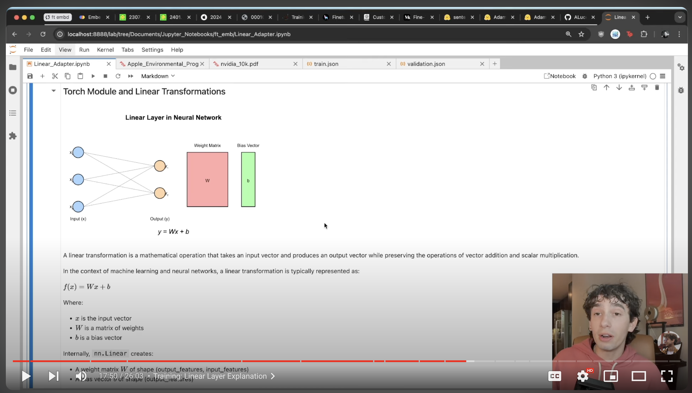
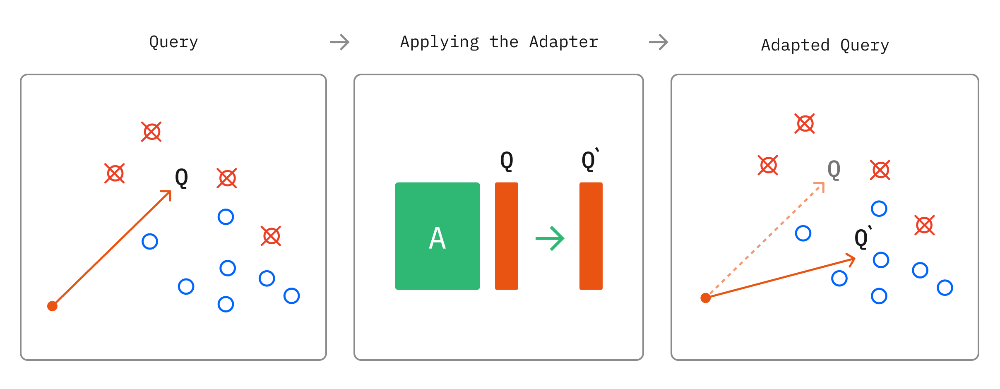
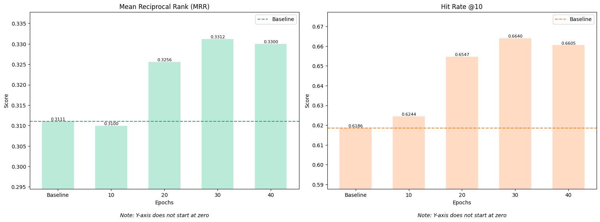

# Fine-Tuning Embedding Models for RAG Pipeline Optimization

## Check out my Video Walkthrough Here 

)
Click play to watch :)

Base embedding models used for both knowledge base embedding and query embedding for context retrieval in RAG-based applications generally work well, but there are ways to optimize their performance to improve correct information retrieval based on historical user queries and more efficiently retrieve domain-specific information.

**Essentially, fine-tuning embedding models on your data to improve your RAG application!**

I've gone through various papers and implementations of embedding model fine-tuning techniques and determined that the most efficient way to get this improvement is through a **query-only linear adapter**, or training a simple linear layer transformation to better represent user queries in embedding space for improved retrieval.

This allows us to very easily plug into existing RAG pipelines and optimize for our specific task without needing to completely re-embed our knowledge base or use a lot of resources training larger models, making this a simple, cost/compute-effective way to improve retrieval performance.

Additionally, while it's preferred to use existing labeled data gathered through something like RAG Question Answering Chatbot logs, it is possible to also improve embedding representations with synthetically generated labels.

In this notebook we will:
1. Define a RAG application to optimize
2. Generate a synthetic dataset with gpt-4o-mini
3. Test retrieval metrics to gather a baseline for all-MiniLM-L6-v2
4. Create and train a linear adapter
5. Plug the adapter onto all-MiniLM-L6-v2 and assess performance

Along the way, we'll be implementing many methodologies from [ChromaDB's Research](https://research.trychroma.com/embedding-adapters) on a small scale for task-specific performance increases, specifically their recommendations for triplet loss, random negative sampling, and linear query-only transformation.

Model adapters trained in this notebook published to [AdamLucek/all-MiniLM-L6-v2-query-only-linear-adapter-AppleQA](https://huggingface.co/AdamLucek/all-MiniLM-L6-v2-query-only-linear-adapter-AppleQA)
